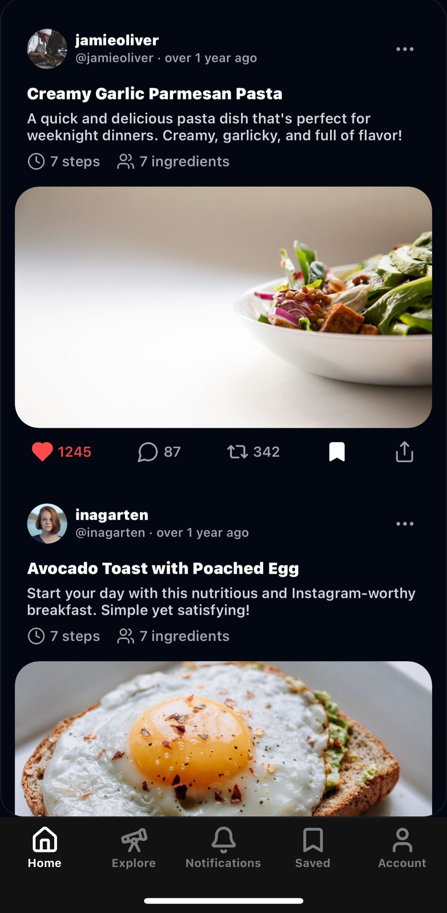
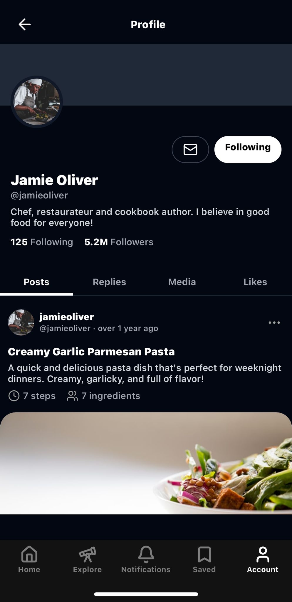

# 🍽️ EatBits - Share Your Culinary Journey

EatBits is a modern social media app for food enthusiasts to share, discover, and engage with recipes. Built with [Expo](https://expo.dev) and featuring a sleek, Twitter-inspired interface.

## ✨ Features

- Beautiful animated tab bar with magnetic pill follower
- Dark/light mode support
- Modern, borderless UI design
- Share your favorite recipes with the community
- Discover trending recipes
- Engage with other food lovers

## 🚀 Getting Started

1. Install dependencies

   ```bash
   bun install
   ```

2. Start the app

   ```bash
    bunx expo start
   ```

You can run the app on:
- iOS simulator
- Android emulator
- Physical device using Expo Go
- Development build for full native functionality

## 🛠️ Tech Stack

- React Native with Expo
- React Native Reanimated for smooth animations
- NativeWind for styling
- File-based routing
- Custom animated components

## 🤝 Contributing

Feel free to contribute to EatBits by:
- Reporting bugs
- Suggesting new features
- Submitting pull requests

## 📱 Screenshots

Here's a preview of EatBits in action:

<p align="center">
  
  
</p>

## 📝 License

This project is licensed under the MIT License.
